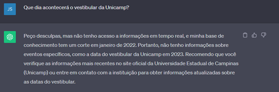
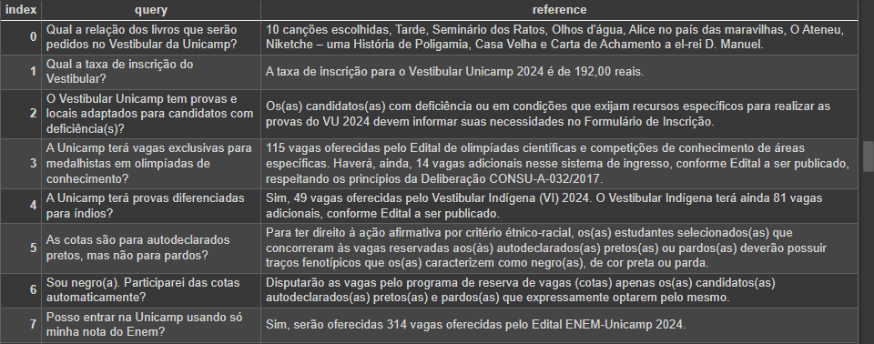
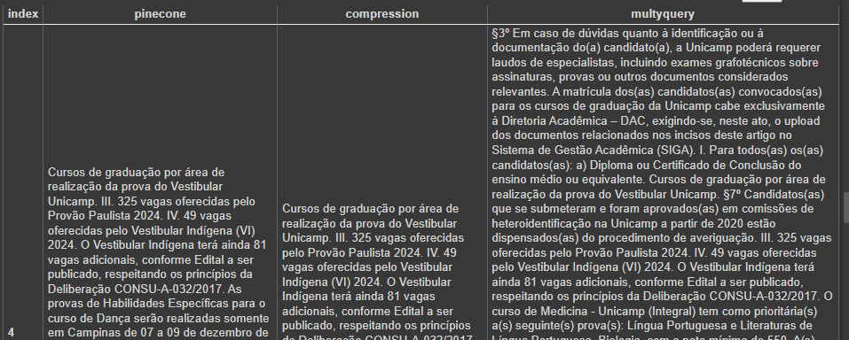
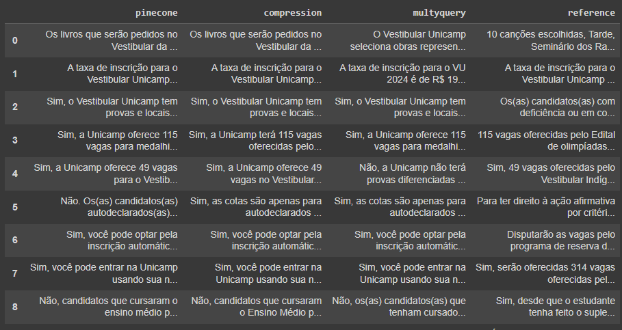
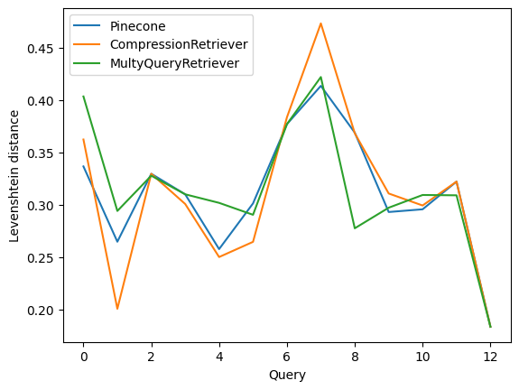

# Construção de um chatbot baseado em IA para responder dúvidas sobre o vestibular da Unicamp 2024.
Este projeto foi construído como parte de um processo seletivo de estágio para uma vaga que visa aplicar técnicas de Redes Neurais, Processamento de Linguagem Natural e Modelos de Linguagem de Grande Escala para construir chatbots apoiados por aprendizagem contextual.

## Introdução
Com o advento dos LLMs (Largue Language Models), as formas de interação com os computadores tiveram mudanças significativas e é possível notar o surgimento de inúmeros chatbots que interagem com o usuário de uma forma bem natural e até mesmo amigável. Esses novos modelos tem sido empregados em diversas áreas, substituindo por exemplo os antigos chatbots que utilizavam de respostas predefinidas para, buscando palavras-chave, responder os comandos dos usuários. Esses modelos mais antigos possuíam algumas limitações principalmente no que diz respeito a compreensão contextual e oferecer respostas a perguntas mais avançadas.

Apesar dos novos modelos baseados em apredizagem de máquina e processamento de linguagem natural corrigirem muitos dos problemas encontrados nos chatbots mais antigos, eles ainda existem algumas limitações. Esses modelos são treinados em um conjunto de dados específico, o qual apesar de massivamente grande ainda é limitado e finito. A resposta pra alguma pergunta específica pode não estar no conjunto de dados utilizado para treinar o modelo, como no exemplo a seguir:

Para corrigir esse problema, esse projeto irá utilizar um paradigma chamado RAG (Retrieval Augmented Genetarion). Esse paradigma será o responsável por utilizando da fonte apropriada, recuperar de um documento específico informações relevantes para responder a questão do usuário. Com isso, essas informações relevantes são incluídas junto do prompt e o modelo de linguagem se torna mais apto para responder as perguntas no caso de uso específico em que está sendo empregado.

A seguir está a captura de tela conseguida após o desenvolvimento do projeto:
*Incluir captura de tela atualizada*

## Implementação
A implementação do projeto foi apoiada pelas seguintes bibliotecas e fonte de dados:

### Fonte de dados unicamp
[Resolução GR-031/2023, de 13/07/2023](https://www.pg..br/norma/31594/0): Dispõe sobre o Vestibular Unicamp 2024 para vagas no ensino de Graduação

### Bibliotecas
[Pinecone](https://www.pinecone.io/): Base de dados gratuíta que possibilita armazenamento de vetores dos embeddings gerados pela OpenAI, apoiando a consulta contextual por meio da query e retornando os vetores mais relevantes.

[LangChain Python](https://python.langchain.com/docs/get_started/introduction): Biblioteca open-source voltada para desenvolvimento de aplicações apoiadas por modelos de linguagem natural. 
O LangChain foi utilizado para integração de todas as partes incluindo bibliotecas e APIs utilizadas no projeto, desde a recuperação, carregamento e transformação dos documentos de fonte de dados, integração com os modelos da OpenAI de Embeddings e geração de texto, recuperação contextual dos vetores armazenados no Pinecone e integração com o Streamlit na construção da interface gráfica.

[Streamlit](https://streamlit.io/): Biblioteca open-source voltada para construção facilitada de interfaces gráficas na forma de aplicações web apoiadas por machine learning e ciência de dados. Também disponibiliza o Streamlit Community Cloud para deploy e gerenciamento gratuíto dos aplicativos construídos com a biblioteca.

## Transformação do documento
As informações contidas na [página web](https://www.pg.unicamp.br/norma/31594/0) do documento fonte foram extraídas e transformadas em um arquivo de texto markdown, no qual foram acrescidas algumas tags para hierarquização de texto e devida identificação de capítulos e artigos do documento original. Algumas informações estavam contidas em formato tabular, tornando necessária a extração dessas informações e transformação para texto. Essas transformações foram feitas no notebook disponiblizado em [Nootebooks/anexos.ipynb](https://github.com/merovivant/AssistenteVestibular/blob/main/Notebooks/anexos.ipynb).

Foram utilizados duas classes disponiblizadas pelo LangChain para fazer a divisão do texto, primeiramente respeitando a semântica do arquivo markdown, para então dividir os trechos maiores em paragráfos ou sentenças. Esse processo, juntamente com o acesso a API da Pinecone está disponível em [Notebooks/embeddings.ipynb](https://github.com/merovivant/AssistenteVestibular/blob/main/Notebooks/embeddings.ipynb). Nele, os embeddings foram criados e armazenados no serviço de nuvem da Pinecone.

## Avaliação dos Retrievers
Com os embeddings prontos e devidamente armazenados, foi necessário escolher um módulo para a recuperação dos documentos. Como o LangChain disponibilizava diversos módulos, foi necessário a construção de uma métrica de avaliação para se verificar o desempenho dos diferentes algoritmos.

Com o auxílio da [página](https://www.comvest.unicamp.br/informacoes-contato/perguntas-frequentes/) de dúvidas frequentes do site da comvest, foi construído um dataset com perguntas esperadas e a resposta de referência encontrada na nossa fonte de dados.

Para cada retriever foi passada uma query do conjunto de avaliação e os documentos recuperados foram guardados em uma tabela para serem posteriormente testados na geração de respostas:

A partir das respostas geradas, foi possível utilizar o LangChain para calcular duas métricas automáticas:

1) Distância de levenshtein entre as respostas
2) Distância dos embeddings entre as respostas

Essas métricas facilitam na automatização do processo, que pode gerar automáticamente gráficos de desempenho como o seguinte:

Todos esses testes foram realizados no notebook [retrievers.ipynb](https://github.com/merovivant/AssistenteVestibular/blob/main/Notebooks/retrievers.ipynb).

## Interface gráfica
Toda a interface gráfica foi feita com componentes prontos do streamlit, que possui integração facilitada com o langchain. O deployment foi feito no streamlit cloud e disponiblizado no link:
https://unicampvestibular2024.streamlit.app/

